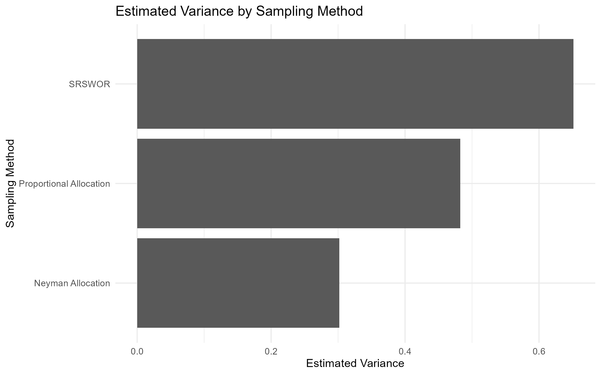
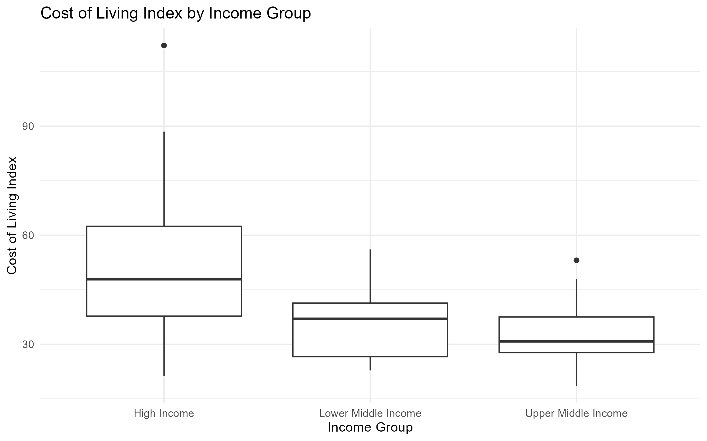

# Global Cost-of-Living Statistical Analysis

## Overview

This project analyzes cost-of-living and economic data across 137 countries using statistical sampling techniques.

The objective is to compare different sampling approaches for estimating the mean Cost of Living Index and evaluate how stratification by income level affects estimator precision.

## Dataset

The dataset contains cost-of-living and economic indicators for 137 countries, including the Cost of Living Index and GNI per capita.

GNI per capita was used to divide countries into three income strata:

- Lower Middle Income
- Upper Middle Income
- High Income

## Tools

- R
- Microsoft Excel
- dplyr
- ggplot2

## Methods

- Simple Random Sampling Without Replacement (SRSWOR)
- Stratified Sampling
- Proportional Allocation
- Neyman Allocation
- Statistical Estimation
- Variance Estimation
- Data Visualization

## Key Results

The three sampling methods were compared using a total sample size of 104 countries.

| Sampling Method | Estimated Mean | Estimated Variance |
|---|---:|---:|
| SRSWOR | 45.234 | 0.6515 |
| Proportional Allocation | 44.779 | 0.4826 |
| **Neyman Allocation** | **44.809** | **0.3018** |

Neyman allocation produced the lowest estimated variance, approximately **54% lower than SRSWOR** and **37% lower than proportional allocation**.

This demonstrates how incorporating both stratum size and within-stratum variability can improve the precision of a stratified estimator while maintaining the same overall sample size.

## Sampling Method Comparison



The variance comparison shows that Neyman allocation provided the most precise estimate among the three sampling strategies.

## Cost of Living Across Income Groups



The distribution of the Cost of Living Index differs across the GNI-based income strata, supporting the use of stratification in the analysis.

## Repository Structure

```text
Cost-of-Living-Statistical-Analysis/
├── README.md
├── analysis/
│   └── cost_of_living_analysis.R
├── data/
│   └── Cost_of_Living_Index_2024.csv
└── figures/
    ├── cost_of_living_by_income_group.png
    ├── cost_of_living_vs_gni.png
    └── sampling_variance_comparison.png
